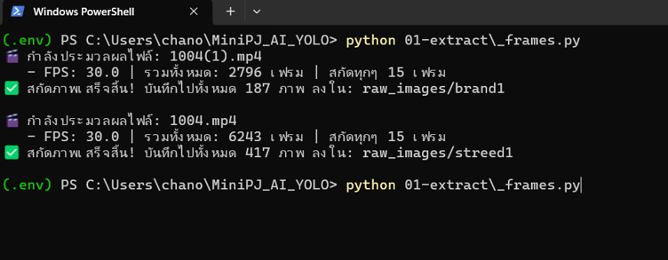
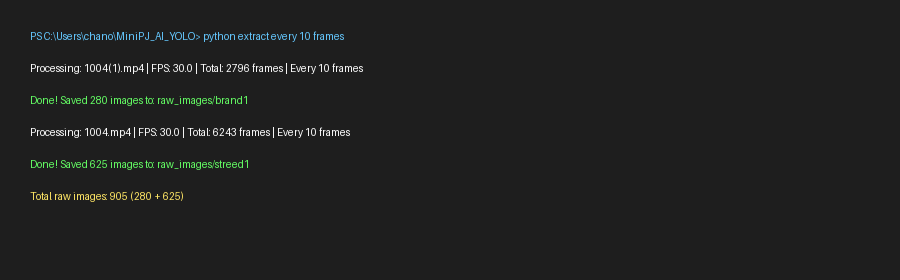
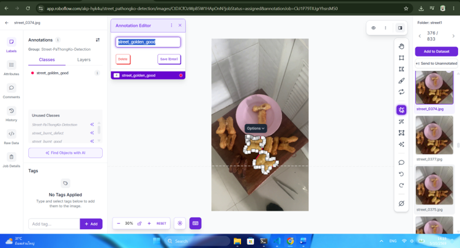
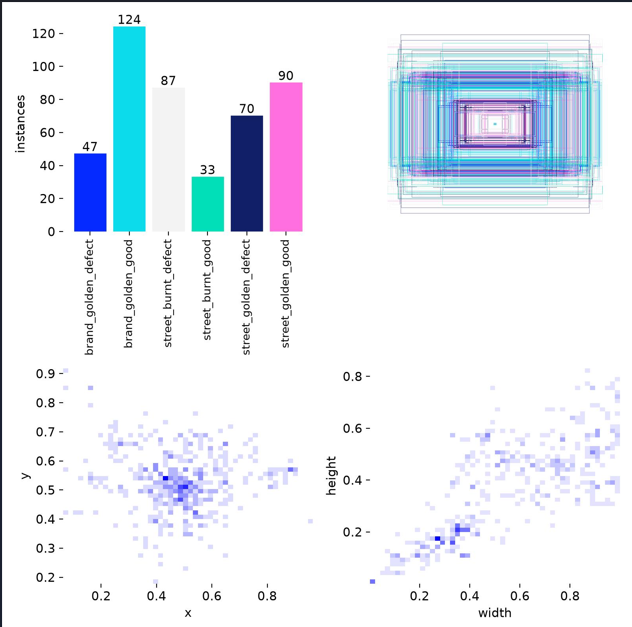

# MiniPJ_AI_YOLO — Patongko Detection (Brand vs Street)

จำแนกปาท่องโก๋ **แบรนด์ vs ร้านทั่วไป + สุก/ไหม้ + ทรงดี/ชำรุด** ด้วย YOLOv8 Detection (6 คลาส)
ถ่ายวิดีโอหน้าร้านจริง 2 คลิป → สกัดเฟรม → label บน Roboflow → เทรน 5 รอบ → ได้โมเดลรอบ 3 ดีสุด

**สถานะ (6 ต.ค. 2026):** เทรนทั้งหมด 5 รอบ — รอบ 3 ดีสุด (label แก้แล้วครบ 100%) — test **mAP50 0.879 ผ่านเป้า 0.85**
รายละเอียดเต็มใน `report.md` / ขั้นตอนแลปใน `report2.md` / ฉบับทฤษฎี+โค้ดใน `report3.md` / บทพูดพรีเซนต์ใน `presentscript.md`

## 1. Dataset `mixed2/` คืออะไร

- `mixed2/` — DTPG v2 จาก Roboflow (852 ภาพ: train 713 / valid 93 / test 46, YOLO bbox 512px)
- ที่มา: `mixed/` v1 480 ภาพ + pseudo-label 524 ภาพที่ผ่านคนตรวจ (ทิ้งภาพซ้ำ 480 + ภาพเปล่า 318)
- `raw_images/` — ภาพดิบ 1,322 ใบ + วิดีโอ 2 ไฟล์ (local only, ไม่ push เพราะ ~800MB)

6 classes ที่เทรนจริง (`nc=6`):

| id | class | train | valid | test | หมายเหตุ |
|----|---|---|---|---|---|
| 0 | brand_golden_defect | 51 | 18 | 10 | แบรนด์สุกชำรุด |
| 1 | brand_golden_good | 147 | 26 | 17 | เยอะสุดฝั่งแบรนด์ |
| 2 | street_burnt_defect | 191 | 23 | 15 | จุดอ่อน R 0.6 |
| 3 | street_burnt_good | 47 | 9 | **0** | น้อยสุด + ไม่มีใน test → `05` ขึ้น N/A |
| 4 | street_golden_defect | 298 | 25 | 13 | เยอะสุด |
| 5 | street_golden_good | 267 | 26 | 13 | - |

> แผนเดิม 8 คลาส แต่ `brand_burnt_good`/`brand_burnt_defect` **0 ภาพ 0 กล่องทั้งชุด** เพราะแบรนด์คุมไฟดี ไม่พบเคสไหม้จริง
> โมเดล `nc=6` จึงจำแนก 2 คลาสนี้ไม่ได้ — เอาแบรนด์ไหม้จ่อกล้องก็ทายเป็น 1 ใน 6 ที่มีเท่านั้น

## 2. สคริปต์ทำอะไรบ้าง (รันตามลำดับ 01→07)

รันด้วย venv: `.\.env\Scripts\python.exe <สคริปต์>` | env: Python 3.13 + torch cu126 + ultralytics 8.4 (GPU RTX 4060)

| ไฟล์ | หน้าที่แบบเข้าใจง่าย | วิธีรัน |
|---|---|---|
| `01-extract/_frames.py` | เปิดวิดีโอด้วย OpenCV เซฟทุก 15 (รอบสอง 10) เฟรม ได้ดิบ 1,322 ใบ | `python 01-extract/_frames.py` |
| `02-train/02-train.py` | สั่ง `YOLO.train()` ได้ `best.pt` (`cls=1.0` + `copy_paste/mixup` ชดเชยคลาสน้อย, `patience=20`) | `python 02-train/02-train.py` |
| `02-train/oversample.py` | ก็อปภาพ train คลาสน้อย 713→1,164 สร้าง `mixed2_os/` (รอบ 5) | `python 02-train/oversample.py` |
| `07-pseudolabel/pseudo_label.py` | เอา best รอบแรกทายภาพดิบ `conf 0.5` ได้ร่าง 524 ภาพ (กัน leakage ชื่อซ้ำ) | `python 07-pseudolabel/pseudo_label.py` |
| `03-predict.py` | ทายภาพนิ่ง default `mixed2/test/images` (46 ภาพ ได้ 59 กล่อง) เซฟภาพ+txt | `python 03-predict.py [path/0]` |
| `04-predict_video.py` | ทายวิดีโอแบบ `stream=True` ทีละเฟรม กันแรมเต็ม | `python 04-predict_video.py [path]` |
| `05-evaluate.py` + `eval_utils.py` | `model.val(split=test)` ตาราง P/R/F1/mAP รายคลาส + confusion matrix + กราฟทีละภาพ | `python 05-evaluate.py` |
| `06-webcam_realtime.py` | เปิดกล้องทาย realtime กด `q` ออก | `python 06-webcam_realtime.py` |

## 3. ผลลัพธ์ (เทรน 5 รอบ — รอบ 3 ดีสุด)

- รอบ1 baseline `yolov8n 50e` val 0.844 → รอบ2 `yolov8n 80e` test 0.867 → **รอบ3 `yolov8n 80e fixed` test 0.879 ดีสุด** → รอบ4 `yolov8s` test 0.872 (overfit) → รอบ5 oversample `yolov8s 100e` test 0.878 (เสมอตัว)
- **รอบ 3 (ใช้จริง):** Val P 0.806 / R 0.896 / **mAP50 0.895** | Test P 0.942 / R 0.857 / **mAP50 0.879**
- รายคลาส test: brand ทั้งคู่ ~0.9+, `street_golden_defect` 0.995, `street_golden_good` 0.909, จุดอ่อน `street_burnt_defect` 0.605 (R 0.6)
- Weights: `runs/detect/pathongko_mixed3_fixed/weights/best.pt` (local only, ไม่ push)
- จุดอ่อน: `street_burnt_defect` test R 0.6 — ต้องเก็บตัวอย่างไหม้จริงเพิ่ม (ก็อปซ้ำไม่ช่วย)
- ข้อจำกัด: `brand_burnt_*` ไม่มีข้อมูลเลย + `street_burnt_good` ไม่มีใน test

## 4. ตัวอย่าง detect (จาก `03-predict.py` 46 ภาพ)

- brand 3 กล่องถูก (`defect 0.71 + good 0.91/0.93`), street 3 กล่องถูก (`good 0.97 + defect 0.94/0.96`)
- เคสหลุด: `street_0379` มี ~8 ชิ้นจับได้แค่ `burnt_defect` 2 กล่อง — ตรงจุดอ่อน R 0.6
- 2 ภาพ close-up (`street_0424/0428`) ไม่มี detection

